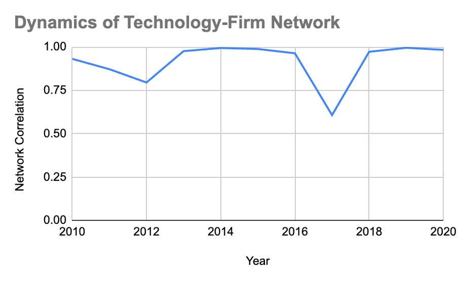
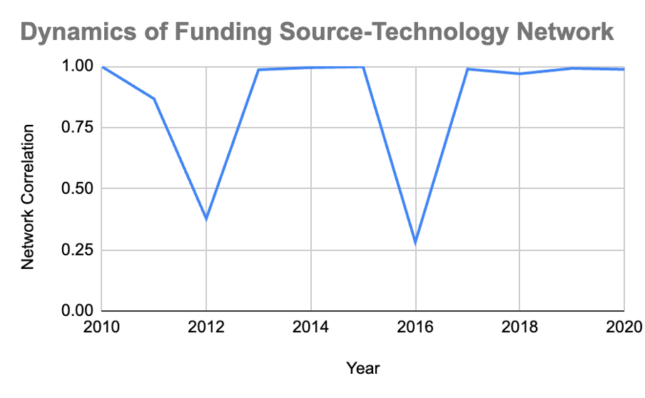

# Network Analysis on governmnetal R&D fund and private firm

## Data collection
* Data collected from NTIS [[https://www.ntis.go.kr/ThMain.do]]
* As a open R&D initiative, the database offer governmental funding sources and its distribution 
* Unfortunately, it does not allow second-publishment, so I uploaded a sample data format in the NTIS/data folder 
* Data range: 2010-2023
## Methods
* I extracted three colunms (Funding source, R&D firm, technological classification code) for each R&D project from the dataset
* Then, the 2-mode matrix was created for each combinations
* The matrix was converted into 1-mode, by multiplying its transposed counterpart. 
* The dynamics of network was calculated from the yearly correlations
## Results
* Three network dynamics were analyzed in combination of Technology category-Firm, Funding source-Firm, and Funding source-Technology category 
* Interestingly, the network was stable and remained almost stagnated over decades, but experienced a disruption in 2012 and 2016, when the presidential election was held. 

